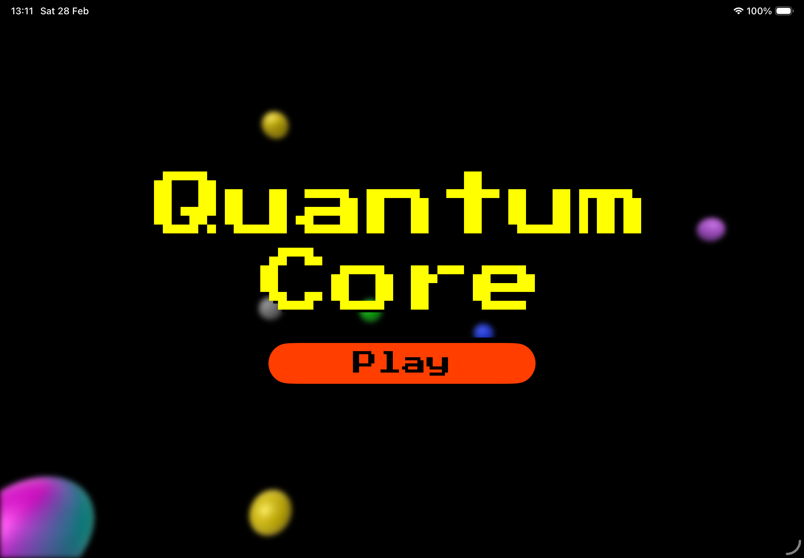
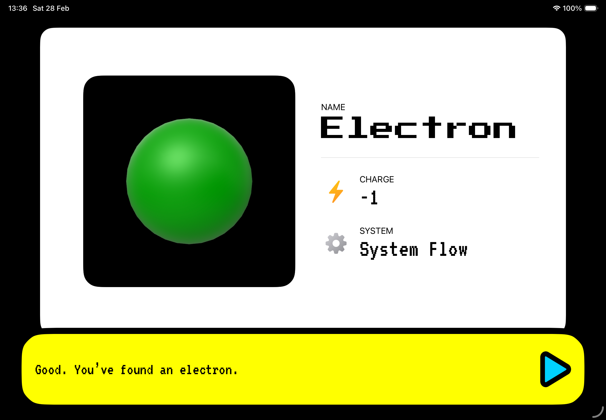
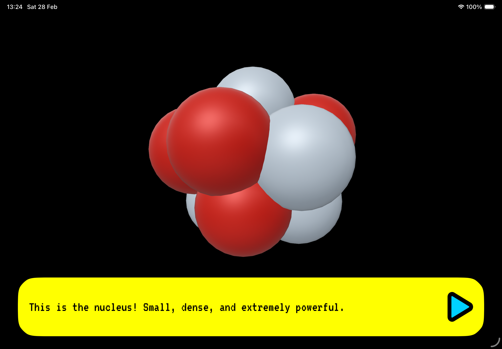

# Quantum Core

---

## 🎮 Sobre a Experiência

**Quantum Core** é uma experiência 3D imersiva desenvolvida com **RealityKit**, focada no aprendizado interativo sobre partículas subatômicas.

A proposta é transformar conceitos abstratos da física em uma jornada explorável, onde o usuário mergulha na estrutura fundamental da matéria, interagindo diretamente com elétrons, quarks e outros elementos do universo microscópico.

---

## ✨ Features

### ⚛️ Exploração Subatômica
- Navegue por um ambiente 3D representando o interior do átomo  
- Descubra partículas fundamentais de forma visual e interativa  
- Aproxime-se de estruturas invisíveis ao olho humano  

### 🎯 Interações Educativas
- Toque e colete partículas para aprender suas propriedades  
- Feedback visual e narrativo durante a exploração  
- Sistema progressivo de descoberta  

### 🌌 Imersão em Física
- Representação simplificada e intuitiva de conceitos científicos  
- Aprendizado baseado em exploração livre  
- Integração entre narrativa e conteúdo educacional  

---

## 🖼️ Preview da Experiência

---

## 🛠️ Tecnologias Utilizadas

- 🧡 **RealityKit**
- 🧡 **Swift**
- 🧡 **Blender**
- 🧡 **3D Interaction Design**
- 🧡 **Game Design Educacional**

---

## 👤 Desenvolvedor

Este projeto foi desenvolvido por:

- Marlon Ribas

---

## 🔗 Repositório

