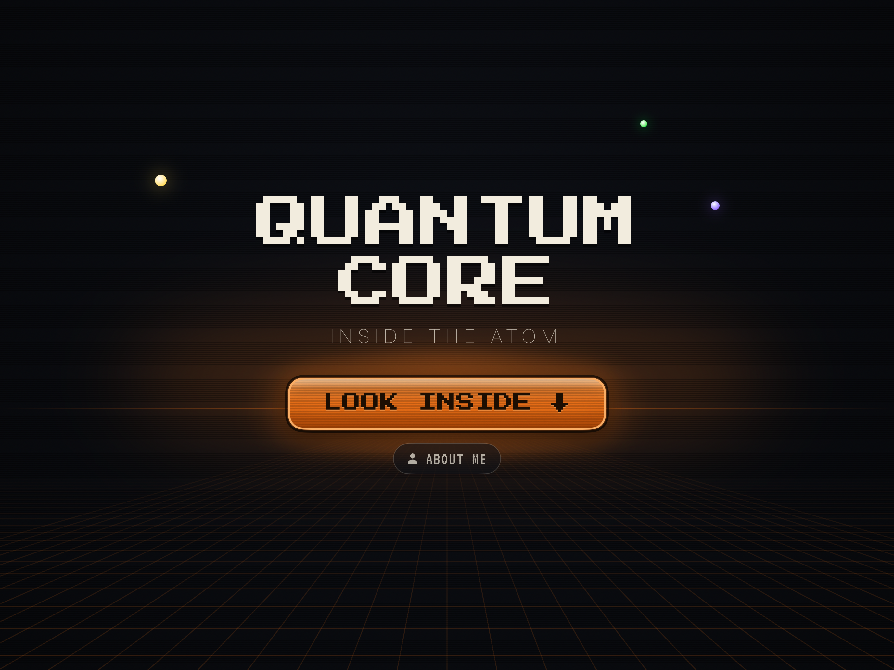
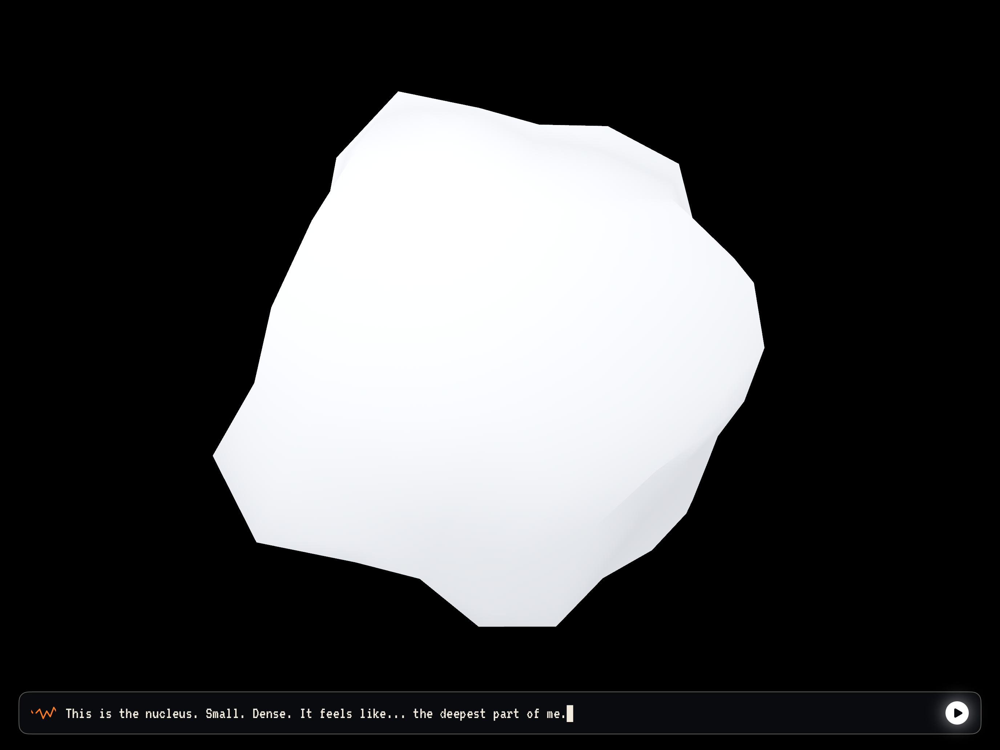
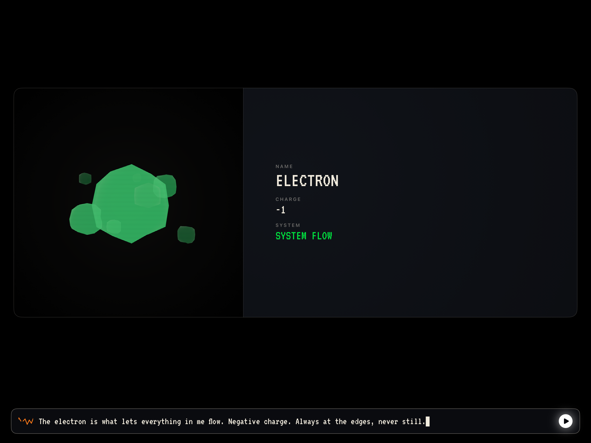

# Quantum Core

### Mergulhe na estrutura fundamental da matéria em uma experiência 3D imersiva.

---

## 🎮 Sobre a Experiência

**Quantum Core** é uma experiência 3D imersiva desenvolvida com **RealityKit**, focada no aprendizado interativo sobre partículas subatômicas.

A proposta é transformar conceitos abstratos da física em uma jornada explorável, onde o usuário mergulha na estrutura fundamental da matéria, interagindo diretamente com elétrons, quarks e outros elementos do universo microscópico.

---

## 🧭 Como Explorar
 

  
| 🌌 Mergulhe | ⚛️ Interaja | 🧠 Descubra |
|:---:|:---:|:---:|
| Entre no ambiente 3D e navegue pelo interior do átomo | Toque e colete as partículas fundamentais que encontrar | Aprenda as propriedades e os conceitos da física no seu ritmo |
 

---

## ✨ Funcionalidades

### ⚛️ Exploração Subatômica
Navegue por um ambiente 3D que representa o interior do átomo, descobrindo partículas fundamentais de forma visual e interativa e aproximando-se de estruturas invisíveis ao olho humano.

### 🎯 Interações Educativas
Toque e colete partículas para aprender suas propriedades, com feedback visual e narrativo durante a exploração e um sistema progressivo de descoberta.

### 🌌 Imersão em Física
Representação simplificada e intuitiva de conceitos científicos, com aprendizado baseado em exploração livre e integração entre narrativa e conteúdo educacional.

---

## 🖼️ Preview da Experiência

---

## 🛠️ Tecnologias

| Camada | Stack |
|---|---|
| **Engine 3D** | RealityKit |
| **Linguagem** | Swift |
| **Modelagem 3D** | Blender & Reality Composer Pro |

---

## 👤 Desenvolvedor

- [**Marlon Ribas**](https://github.com/marlonribasoficial)
